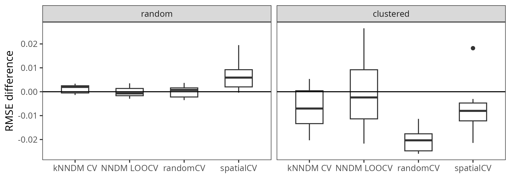

# PDAV
This repository is a collection of prediction-domain adaptive validation methods. Due to the growing application of spatial predictive models in geoscientific fields, there is also a growing need for reliable validation of the resulting maps. Prediction-domain adaptive validation methods provide reliable proxies of map accuracies that can be used during model selection and also -- in the absence of an independent probability sample -- as a proxy of the final map accuracy. This repository aims at:

1) collecting and consistently implementing prediction-domain adaptive validation methods applicable for spatial predictive modelling.
2) providing vignettes that describe their functioning and application.
3) providing an overview over the developed methods.
4) comparing the performance of the validation methods as compared to random and spatial CV on a common benchmark dataset.

As such, the repository is expected to grow and include newly developed methods falling in the class of prediction-domain adaptive validation.

## Overview over the currently developed methods:

Below, you can find a technical comparison of the different approaches.

| Method | Authors | Short Description | Critical Parameters |
| ----------- | ----------- | ----------- | ----------- |
| [NNDM](R/nndm.R) | [Milà et al. (2022)](https://doi.org/10.1111/2041-210X.13851) | - Formalizes the prediction situation as the Nearest Neighbour Distance (**NND**) distribution between prediction locations and training samples. - Then, for every k in N, it calculates the NND between the training samples and the hold-out sample. - It **excludes the training point that is clostest to the held-out point** until the NND between the training samples and the held-out point matches the NND between prediction points and training samples. | - `phi`: Autocorrelation threshold up to which Nearest-Neighbour distances are being matched. - `min_train`: fold balancing |
| [kNNDM](R/knndm.R) | [Linnenbrink & Milà et al. (2024)](https://doi.org/10.5194/gmd-17-5897-2024) | - Formalizes the prediction situation as the **NND** distribution between prediction locations and training samples. - Uses clustering to create a **continuum of fold configurations** ranging from random resampling to a blocked split. - Then selects the configuration that best approximates the prediction situation. | - `maxp`: fold balancing |
| [DA-CV](R/da_cv.R) |  [Wang et al. (2025)](https://doi.org/10.1016/j.ecoinf.2025.103287) | - Uses **adversial validation** to classify the prediction area into locations that are similar or dissimilar to the training samples. - Returns a random and a spatial resampling splits. - The validation statistics obtained by these two splits are then **weighted by the proportion of similar or dissimilar areas**, respectively. | - `autoc_threshold`: block size in spatial cross-validation |

As a guideline for choosing an appropriate method, the table below summarises some advantages and disadvantages of the different methods.

| Method      | Advantages | Disadvantages |
| ----------- | ----------- | ----------- |
| NNDM      | - direct quantification of the prediction situation through nearest-neighbour distances | - high computational costs since it uses LOO-CV |
| kNNDM   | - direct quantification of the prediction situation through nearest-neighbour distances - more computational efficient than NNDM | ab |
| DA-CV      | - creates a map that depicts areas of inter- vs extrapolation, which can be useful for subsequent sampling or for uncertainty assessment - | - less direct approximation of the prediction situation |

## Benchmarking

The following figure shows the results of the benchmarking study for different sampling designs. The simulation can be reproduced in the [vignette](vignettes/benchmarking.Rmd).

This figure shows the computational costs of each method:

## List of research papers
* Milà, C., Mateu, J., Pebesma, E., Meyer, H. (2022): Nearest Neighbour Distance Matching Leave-One-Out Cross-Validation for map validation. Methods in Ecology and Evolution 00, 1– 13.
https://doi.org/10.1111/2041-210X.13851

* Linnenbrink, J., Milà, C., Ludwig, M., and Meyer, H. (2024): kNNDM: k-fold Nearest Neighbour Distance Matching Cross-Validation for map accuracy estimation. GMD, 17, 5897–5912.
https://doi.org/10.5194/gmd-17-5897-2024

* Wang, Y., Khodadadzadeh, M. and Zurita-Milla, R. (2025): A dissimilarity-adaptive cross-validation method for evaluating geospatial machine learning predictions with clustered samples. Ecological Informatics 90, 1574-9541.
https://doi.org/10.1016/j.ecoinf.2025.103287
