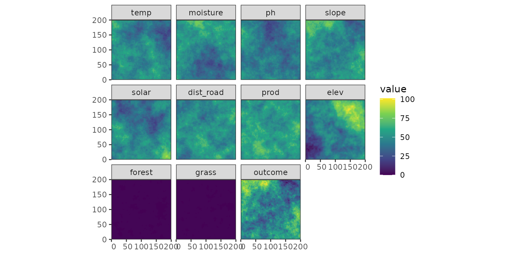
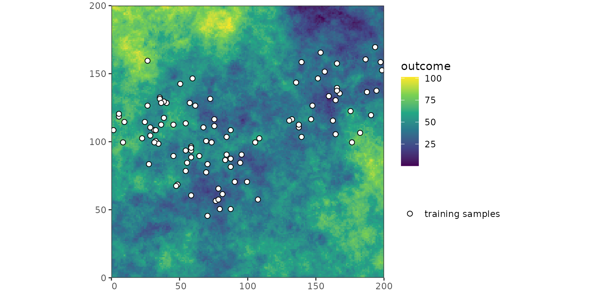
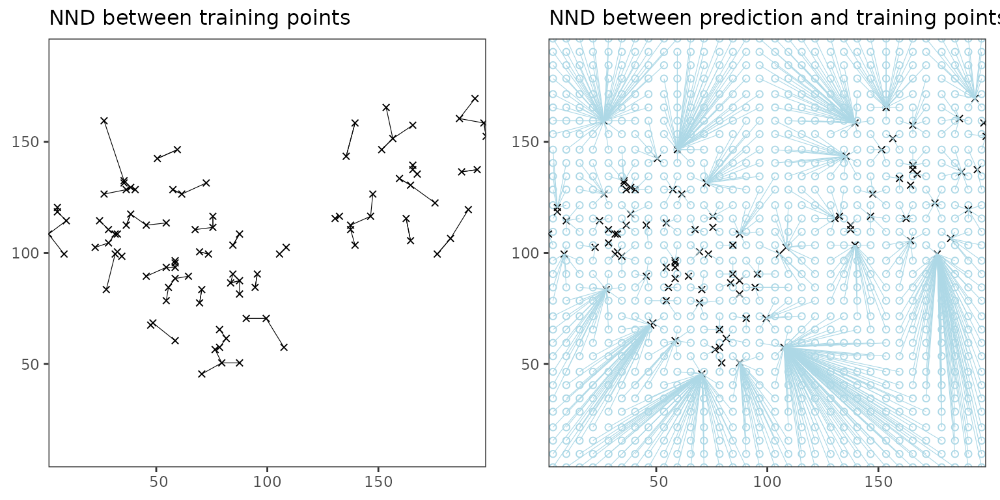
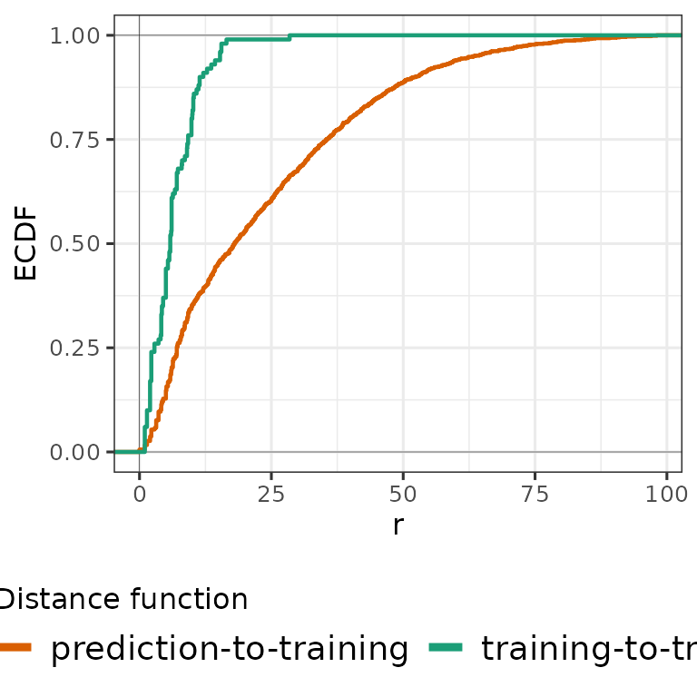
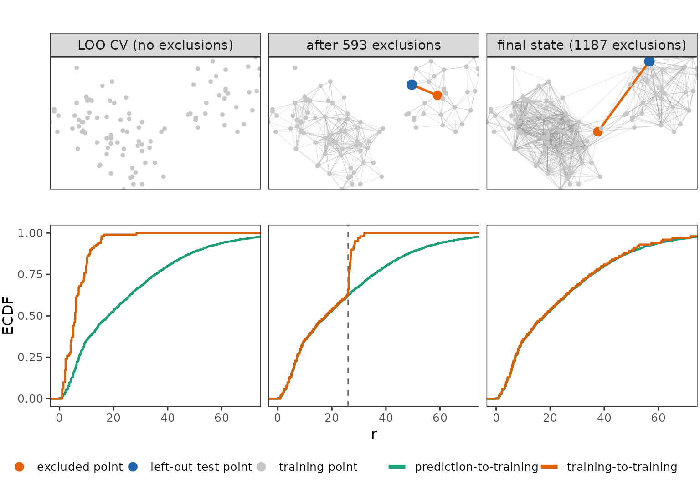

# NNDM

## Introduction

Nearest-neighbour distance matching (NNDM) leave-one-out (LOO)
cross-validation was developed by Milà et al. (2022). It matches the
distribution of nearest-neighbour distances (NNDs) encountered during CV
to the one encountered during prediction. This is achieved by excluding
a variable number of the nearest training points of each left-out point
from the training set. Because NNDM is LOO-based, it requires as many
model fits as there are training points. It is therefore more flexible,
but also considerably slower, than kNNDM. NNDM is best suited to small
datasets, and kNNDM should be preferred for larger ones.

Three NND distributions are involved:

- *Ĝ*_(ij): the empirical distribution of distances from each prediction
  point to its nearest training point;
- *Ĝ*_(j): the empirical distribution of distances from each training
  point to its nearest other training point, i.e. the NND distribution
  of plain LOO CV;
- *Ĝ*_(j)^(\*): the modified version of *Ĝ*_(j) produced by NNDM, which
  is matched to *Ĝ*_(ij).

The more detailed workflow is:

1.  Compute *Ĝ_(ij)* and *Ĝ_(j)*.
2.  Choose *φ*, the distance up to which matching is performed. By
    default (`phi = “max”`) the maximum observed distance is used, so
    matching covers the entire range. Alternatively, an estimate of the
    autocorrelation range can be supplied; beyond *φ* no training points
    are excluded and all data are used for training.
3.  Derive *Ĝ_(j)*, starting from plain LOO CV (*Ĝ_(j)* = *Ĝ_(j)*) and
    processing all training-point NNDs in increasing order. For the
    current distance *r*, which belongs to left-out point *j* and its
    nearest remaining training point *k*:
    1.  check whether removing *k* from the training set of *j* would
        still leave *Ĝ_(j)^(\*)*(*r*) ≥ *Ĝ_(ij)*(*r*), i.e. whether CV
        distances are still shorter than prediction distances at *r*;
    2.  check whether fold *j* would still retain at least `min_train`
        (default 50%) of the training data;
    3.  if both conditions hold, exclude *k* from fold *j* and update
        *Ĝ_(j)^(\*)*; otherwise leave fold *j* unchanged. Exclusions are
        never undone;
    4.  move on to the next-smallest NND, and stop once it exceeds *φ*.
4.  Return, for each left-out point, the indices of the test point, the
    retained training points and the excluded points (`indx_test`,
    `indx_train`, `indx_exclude`). These can be passed directly to
    caret’s `trainControl(index = , indexOut = )` or used to set up a
    custom resampling strategy in mlr3.

## Setup

``` r

library(PDAV)
library(terra)
#> terra 1.9.46
library(sf)
#> Linking to GEOS 3.12.1, GDAL 3.8.4, PROJ 9.4.0; sf_use_s2() is TRUE
library(simsam)
library(ggplot2)
library(cowplot)
library(tidyterra)
#> 
#> Attaching package: 'tidyterra'
#> The following object is masked from 'package:stats':
#> 
#>     filter
library(ggnewscale)
library(dplyr)
#> 
#> Attaching package: 'dplyr'
#> The following objects are masked from 'package:terra':
#> 
#>     intersect, union
#> The following objects are masked from 'package:stats':
#> 
#>     filter, lag
#> The following objects are masked from 'package:base':
#> 
#>     intersect, setdiff, setequal, union

set.seed(100)

k <- 2
```

## Example data

### Simulate predictors and response

``` r

r <- PDAV:::generate_rast()
samples <- PDAV:::generate_samples(r, 100) |>
    filter(sampling == "biased")
samples$point_id <- 1:nrow(samples)
samples <- select(samples, point_id)
```



## NNDM in geographical space

### 1. Compute G_(j) and G_(ij)

Firstly, the NNDM algorithm calculates the distribution of NND between
samples (G_(j)), as well as the distribution of NNDs between prediction
points and samples (G_(ij)). The calculation of NNDs is shown in the
following figure: the nearest neighbour distance between samples is
shown in the left panel, while the right panel shows nearest neighbour
distances between prediction points and samples.



To characterize the distribution of these NNDs, their empirical
cumulative density functions (ECDFs) are calculated:

``` r

# Compute nearest neighbour distances between training and prediction points
Gij <- sf::st_distance(prediction_points, samples)
units(Gij) <- NULL
Gij <- apply(Gij, 1, min)

# Compute distance matrix of training points
tdist <- sf::st_distance(samples)
units(tdist) <- NULL
diag(tdist) <- NA
Gj <- apply(tdist, 1, function(x) min(x, na.rm = TRUE))
```



### 2. Calculate G_(j)^(\*) for each left-out point starting from LOO-CV

Secondly, the algorithm starts with the smallest NND found among the
training points, i.e. with the left-out point j whose nearest training
point k is closest. It then tests whether excluding k from the training
set of j would keep Ĝ_(j)^(\*)(r) ≥ Ĝ_(ij)(r) at that distance r – that
is, whether CV distances are still shorter than prediction distances
there – and whether fold j would still retain at least min_train (50% by
default) of the training data. If both hold, k is excluded from that
fold only; it remains available for training in all other folds. The
algorithm then moves on to the next-smallest NND, which usually belongs
to a different left-out point. Otherwise the exclusion is skipped and
the algorithm proceeds to the next-larger NND. This continues until the
current distance exceeds φ.

``` r

# initialize Gjstar
Gjstar <- Gj

min_train <- 0.5
dimnames(tdist) <- NULL
tdist0 <- tdist # keep an untouched copy for plotting

# select the held-out point (jmin) with the closest distance to its nearest training point (kmin)
rmin <- min(Gjstar)
jmin <- which.min(Gjstar)[1]
kmin <- which(tdist[jmin, ] == rmin)

# set phi to the maximum relevant distance
phi <- max(c(Gij, c(tdist)), na.rm = TRUE) + 1e-9

# Check if removing the point yields a higher Gjstar than the target Gij
# Target Gij (at the current distance):
current_Gij <- (sum(Gij <= rmin) / length(Gij))
# Gjstar that would result from excluding the training point:
current_Gjstar <- (sum(Gjstar <= rmin) - 1) / length(Gjstar) # -1: if kmin were excluded, the NND of point jmin would exceed rmin,so it would no longer be counted
Gjstar_greater_check <- current_Gjstar >= current_Gij

# Check if the minimum number of training data is preserved:
min_train_check <- sum(!is.na(tdist[jmin, ])) / ncol(tdist) > min_train

# for plotting only: create a list that captures the output of the algorithm
snap <- list(list(j = NA_integer_, k = integer(0), r = NA_real_, Gjstar = Gjstar))

# If both checks pass, proceed with the NNDM algorithm:
while (rmin <= phi) {
    if (
        (sum(Gjstar <= rmin) - 1) / length(Gjstar) >= sum(Gij <= rmin) / length(Gij) &&
            sum(!is.na(tdist[jmin, ])) / ncol(tdist) > min_train
    ) {
        tdist[jmin, kmin] <- NA
        Gjstar <- apply(tdist, 1, min, na.rm = TRUE)
        snap[[length(snap) + 1L]] <- list(j = jmin, k = kmin, r = rmin, Gjstar = Gjstar)

        rmin <- min(Gjstar[Gjstar >= rmin])
    } else if (sum(Gjstar > rmin) == 0) {
        break
    } else {
        rmin <- min(Gjstar[Gjstar > rmin])
    }
    jmin <- which(Gjstar == rmin)[1]
    kmin <- which(tdist[jmin, ] == rmin)
}

indx_exclude <- lapply(seq_len(nrow(tdist)), \(i) setdiff(which(is.na(tdist[i, ])), i))
```

The following Figure shows the sequential removal of points in the NNDM
algorithm. It starts from plain LOO CV (left) to the completed matching
(right). In each column the algorithm is processing the current
nearest-neighbour distance `r` (dashed line in the bottom row): the
left-out point is blue, the neighbour excluded from its fold orange, and
faint grey lines show all pairs excluded earlier. The blue point differs
between columns because distances are processed in increasing order
across all folds, not fold by fold. `r` grows from left to right, so the
orange link becomes longer. In the bottom row Ĝ_(j)^(\*) is adjusted
from short NNDs resulting from plain LOO CV towards the target Ĝ_(ij).
The right panel is the last iteration that produced an exclusion that
was accepted (the maximum distance allowed by φ would have been 202, but
the maximum exclusion distance was 87).



Milà, Carles, Jorge Mateu, Edzer Pebesma, and Hanna Meyer. 2022.
“Nearest neighbour distance matching leave-one-out cross-validation for
map validation.” *Methods in Ecology and Evolution* 13 (6): 1304–16.
<https://doi.org/10.1111/2041-210X.13851>.
