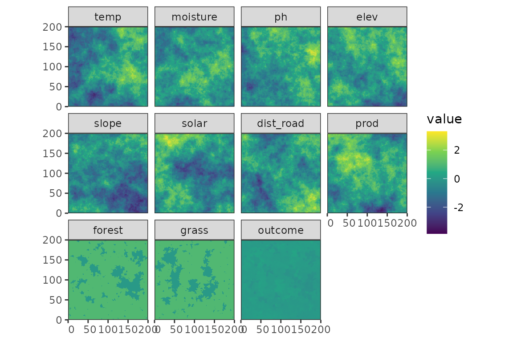
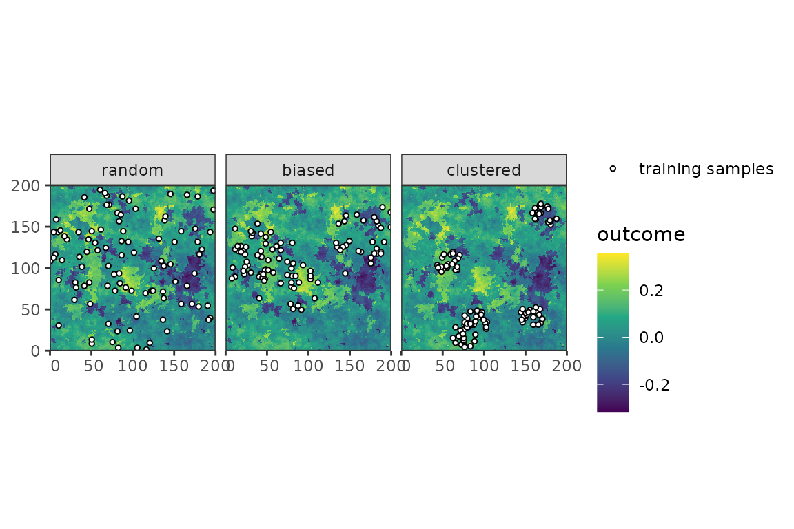
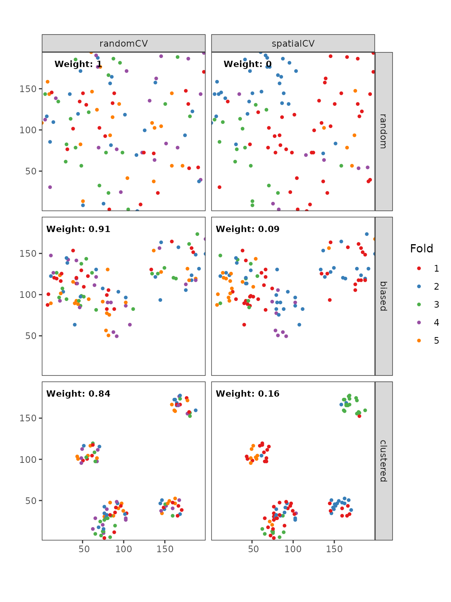

# PDAV

## Introduction

This document gives an overview over the prediction-domain adaptive
validation methods currently implemented.

## Setup

``` r

library(PDAV)
library(dplyr)
#> 
#> Attaching package: 'dplyr'
#> The following objects are masked from 'package:stats':
#> 
#>     filter, lag
#> The following objects are masked from 'package:base':
#> 
#>     intersect, setdiff, setequal, union
library(caret)
#> Loading required package: ggplot2
#> Loading required package: lattice
library(terra)
#> terra 1.9.27
library(sf)
#> Linking to GEOS 3.12.1, GDAL 3.8.4, PROJ 9.4.0; sf_use_s2() is TRUE
library(simsam)
library(ggplot2)
library(cowplot)
library(tidyterra)
#> 
#> Attaching package: 'tidyterra'
#> The following object is masked from 'package:stats':
#> 
#>     filter
library(ggnewscale)

set.seed(100)
```

## Simulate predictors and response

``` r

r <- PDAV:::generate_rast()
predictor_stack <- r[[setdiff(names(r), "outcome")]]
cate_rasters <- which(names(r) %in% c("forest", "grass"))

samples <- PDAV:::generate_samples(r, 100)
```





## DA-CV

DA-CV (Wang et al. (2025a)) uses adversial validation (AV) to predict
the probability that a prediction location is similar to the training
samples. Then it calculates a RMSE based on random CV, as well as
spatial+ CV (Wang et al. (2023)) and weights both of them according to
the relative area of similar cells (random CV) and dissimilar cells
(spatial+ CV).

``` r

results <- lapply(unique(samples$sampling), function(smpling) {
    samples_smpl <- samples |>
        filter(sampling == smpling) |>
        select(!sampling)

    da_cv(
        samples = samples_smpl,
        predictors = r,
        response = "outcome",
        folds_k = 5,
        autoc_threshold = 1
        #cate_col_start = min(cate_rasters),
        #cate_col_end = max(cate_rasters)
    )
})
#> Setting levels: control = 0, case = 1
#> Setting direction: controls < cases
#> Setting levels: control = 0, case = 1
#> Setting direction: controls < cases
#> Setting levels: control = 0, case = 1
#> Setting direction: controls < cases

names(results) <- unique(samples$sampling)
```

For randomly distributed samples, the AV classifier has a performance of
$`AUC = 0.5`$. This is then normalized to $`D = 0`$, because the
classifier is not better than randomly guessing if a prediction location
is similiar or dissimilar (see Wang et al. (2025b), section 2.1 for more
information). The threshold is then calculated as $`T(D) = 0.5 * 0`$,
which is 0. This means that all prediction locations are similar to the
training 1, and no extrapolation is required, as can be seen in the
following map. All weights will be given to random CV.

For clustered samples, the AV classifier achieves a performance of
$`AUC = 0.81`$. This leads to $`D = \frac{0.81 - 0.5}{1 - 0.5} = 0.62`$.
The threshold is then $`T(D) = 0.5* 0.62 = 0.3`$. Hence, all prediction
cells with a similarity score lower than 0.3 are classified as
dissimilar. The relative fraction of prediction locations being similar
ro the sampling locations is 0.84, while the fraction being dissimilar
is 0.16.

``` r

lapply(unique(samples$sampling), function(smpling) {
    plot(results[[smpling]]) +
        new_scale_fill() +
        geom_sf(data = samples[samples$sampling == smpling, ], shape = 21, fill = "white") +
        coord_sf(expand = FALSE, datum = st_crs(samples[samples$sampling == smpling, ], )) +
        ggtitle(smpling) +
        theme(
            legend.position = "right",
            plot.title = element_text(face = "bold", hjust = 0.5)
        )
}) |>
    plot_grid(plotlist = _, nrow = 1, align = "vh")
```


Figure 3: Similarity maps resulting from the AV classifier.

Lastly, the resulting cross-validation fold assignments can be used to
calculate the weighted RMSE of a spatial predictive model.

``` r

form <- as.formula(paste0("outcome~", paste0(names(predictor_stack), collapse = "+")))
pgrid <- data.frame(mtry = 6, splitrule = "variance", min.node.size = 5)

weighted_RMSE <- lapply(unique(samples$sampling), function(smpling) {
    samples_smpl <- samples |>
        filter(sampling == smpling) |>
        mutate("randomCV" = results[[smpling]]$folds_RDM, "spatialCV" = results[[smpling]]$folds_SP) |>
        st_drop_geometry()

    folds_random <- CAST::CreateSpacetimeFolds(samples_smpl, spacevar = "randomCV", k = 5)
    folds_spatial <- CAST::CreateSpacetimeFolds(samples_smpl, spacevar = "spatialCV", k = 5)

    train_cntrl_random <- trainControl(
        method = "CV",
        index = folds_random$index,
        indexOut = folds_random$indexOut,
        savePredictions = TRUE
    )

    train_cntrl_SP <- trainControl(
        method = "CV",
        index = folds_spatial$index,
        indexOut = folds_spatial$indexOut,
        savePredictions = TRUE
    )

    rand_mod <- train(
        form,
        data = samples_smpl,
        method = "ranger",
        trControl = train_cntrl_random,
        tuneGrid = pgrid
    )

    spat_mod <- train(
        form,
        data = samples_smpl,
        method = "ranger",
        trControl = train_cntrl_SP,
        tuneGrid = pgrid
    )

    err_stats_rand <- CAST::global_validation(rand_mod)
    err_stats_SP <- CAST::global_validation(spat_mod)

    err_stats_weighted <- sqrt(
        results[[smpling]]$weights[["similar"]] *
            (err_stats_rand[["RMSE"]]^2) +
            results[[smpling]]$weights[["different"]] * (err_stats_SP[["RMSE"]]^2)
    )

    prediction <- predict(r, rand_mod)
    list(err_stats_weighted, prediction)
})
#> Registered S3 methods overwritten by 'CAST':
#>   method     from
#>   plot.knndm PDAV
#>   plot.nndm  PDAV
#> Warning in nominalTrainWorkflow(x = x, y = y, wts = weights, info = trainInfo,
#> : There were missing values in resampled performance measures.
```



The RMSE obtained by DA-CV are 0.038 for the random sampling design,
0.05 for the biased sampling and 0.054 for the clustered design.

## kNNDM CV

## NNDM CV

Wang, Yanwen, Mahdi Khodadadzadeh, and Raúl Zurita-Milla. 2023.
“Spatial+: A New Cross-Validation Method to Evaluate Geospatial Machine
Learning Models.” *International Journal of Applied Earth Observation
and Geoinformation* 121: 103364.
https://doi.org/<https://doi.org/10.1016/j.jag.2023.103364>.

Wang, Yanwen, Mahdi Khodadadzadeh, and Raúl Zurita-Milla. 2025a. “A
Dissimilarity-Adaptive Cross-Validation Method for Evaluating Geospatial
Machine Learning Predictions with Clustered Samples.” *Ecological
Informatics* 90: 103287.
https://doi.org/<https://doi.org/10.1016/j.ecoinf.2025.103287>.

Wang, Yanwen, Mahdi Khodadadzadeh, and Raúl Zurita-Milla. 2025b. “On the
Use of Adversarial Validation for Quantifying Dissimilarity in
Geospatial Machine Learning Prediction.” *GIScience & Remote Sensing* 62
(1): 2460513. <https://doi.org/10.1080/15481603.2025.2460513>.
