# k-NNDM

## Introduction

k-fold nearest-neighbour distance matching (kNNDM) cross-validation was
developed by @Linnenbrink2024. It is the k-fold version of NNDM
(@Mila2022), and as such much faster and better suited towards medium to
large sized datasets. As NNDM, kNNDM also matches the distribution of
nearest-neighbour distances (NND) between prediction locations and
training samples during CV, but opposed to NNDM uses a clustering
algorithm instead of excluding training samples.

The more detailed workflow is:

1.  Conmpute the distribution of NNDs between training samples
    ($`G_j`$), as well as between prediction locations and training
    samples ($`G_{ij}`$).
2.  Use the KS-test to evaluate wether $`G_j >= G_{ij}`$, i.e., wether
    the samples are randomly distributed in the prediction area.
3.  1.  If $`G_j >= G_{ij}`$; return a random CV split and stop the
        algorithm here.
4.  2.  Otherwise, continue by clustering the training points into
        $`q \in Q`$, where $`Q = [k, ..., N]`$. This yields a gradient
        from $`k`$ clusters (i.e., one cluster per fold) to $`N`$
        clusters (i.e., one cluster per training sample).
5.  The $`q`$ clusters are then merged along the first principal
    component of the training points coordinates’ until $`k`$ is
    reached. This means that for $`q = N`$, nothing happens and a
    strongly clustered fold configuration is returned. For $`q = N`$, a
    random fold assignment is returned. For everything in-between
    ($`q>k<N`$), a gradient from strongly to weak clustered folds is
    returned.
6.  For each of the $`q`$ fold configurations, the NND distribution
    between the unique folds is calculated ($`G_{j}^*`$), and the
    distance between $`G_j^*`$ and $`G_{ij}`$ is calculated using the
    Wasserstein statistic (W).
7.  The fold configuration yielding the lowest W is returned.

## Setup

``` r

library(PDAV)
library(terra)
#> terra 1.9.27
library(sf)
#> Linking to GEOS 3.12.1, GDAL 3.8.4, PROJ 9.4.0; sf_use_s2() is TRUE
library(simsam)
library(ggplot2)
library(cowplot)
library(tidyterra)
#> 
#> Attaching package: 'tidyterra'
#> The following object is masked from 'package:stats':
#> 
#>     filter
library(ggnewscale)
library(dplyr)
#> 
#> Attaching package: 'dplyr'
#> The following objects are masked from 'package:terra':
#> 
#>     intersect, union
#> The following objects are masked from 'package:stats':
#> 
#>     filter, lag
#> The following objects are masked from 'package:base':
#> 
#>     intersect, setdiff, setequal, union

set.seed(100)

k = 2
```

## Example data

### Simulate predictors and response

``` r

r <- PDAV:::generate_rast()
samples <- PDAV:::generate_samples(r, 100) |>
    filter(sampling == "biased")
samples$point_id <- 1:nrow(samples)
samples <- select(samples, point_id)
```

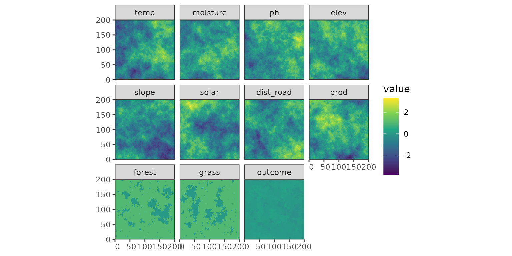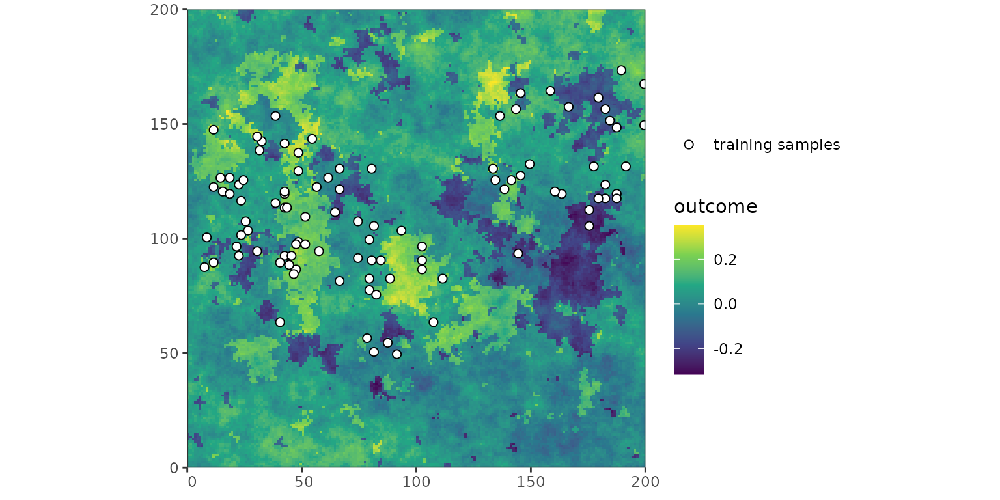

## kNNDM in geographical space

### 1. Compute $`G_j`$ and $`G_{ij}`$

Firstly, the kNNDM algorithm calcuates the distribution of NND between
samples ($`G_j`$), as well as the distribution of NNDs between
prediction points and samples ($`G_{ij}`$). The calculation of NNDs is
shown in the following figure: the nearest neighbour distance between
samples is shown in the left panel, while the right panel shows nearest
neighbour distances between prediction points and samples.

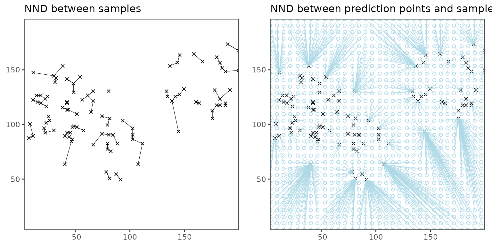

To characterize the distribution of these NNDs, their empirical
cumulative density functions (ECDFs) are calculated:

``` r

Gj <- c(FNN::knn.dist(sample_coords, k = 1))
Gij <- c(FNN::knnx.dist(
    query = pred_coords,
    data = sample_coords,
    k = 1
))
```

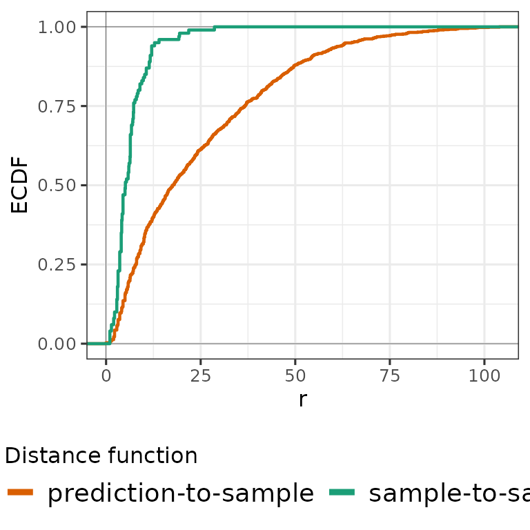

### 2. Test wether $`G_j <= G_{ij}`$

Next, we test if $`G_j`$ \<= $`G_{ij}`$, which would imply a random
sampling design. In that case, the algorithm would stop and return a
random fold assignment. However, as can bee seen below (and also from
the figure above), this is not the case:

``` r

testks <- suppressWarnings(stats::ks.test(Gj, Gij, alternative = "great"))
testks$p.value >= 0.05
#> [1] FALSE
```

### 3. Cluster samples into $`q`$ clusters

Next, we cluster the training points into $`q`$ clusters, where
$`q \in Q`$ and $`Q = [k, ..., N]`$. This means, that $`q`$ is a integer
sequence ranging from the number of folds $`k`$ to the number of
training points $`N`$. The length of this sequence is by default 100,
but for visualization purposes it is reduced to 3 here.

``` r

nk_length <- 3

clustgrid <- data.frame(
    nk = as.integer(round(exp(seq(
        log(k),
        log(nrow(samples) - 2),
        length.out = nk_length
    ))))
)
clustgrid$W <- NA
clustgrid <- clustgrid[!duplicated(clustgrid$nk), ]
clustgroups <- list()

nk_df <- list()
tabclust <- list()
clust_nk <- list()
for (nk in clustgrid$nk) {
    # Create nk clusters
    clust_nk[[nk]] <- stats::kmeans(sample_coords, nk)$cluster
    # tabclust: table containing the unique clust_nks and their frequency
    tabclust[[nk]] <- as.data.frame(table(clust_nk[[nk]]))
    names(tabclust[[nk]]) <- c("clust_nk", "Freq")
    tabclust[[nk]]$clust_k <- NA
}

clustgrid
#>   nk  W
#> 1  2 NA
#> 2 14 NA
#> 3 98 NA
```

The sampled sequence of $`q`$ clusters is in this case 2, 14, 98. The
following figure shows the training points coloured by their cluster for
each of the $`q`$ clusters:

    #> `summarise()` has regrouped the output.
    #> `summarise()` has regrouped the output.
    #> `summarise()` has regrouped the output.
    #> ℹ Summaries were computed grouped by clust_nk and nk.
    #> ℹ Output is grouped by clust_nk.
    #> ℹ Use `summarise(.groups = "drop_last")` to silence this message.
    #> ℹ Use `summarise(.by = c(clust_nk, nk))` for per-operation grouping
    #>   (`?dplyr::dplyr_by`) instead.

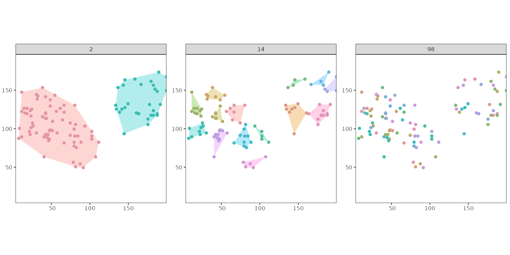

### 4. Merge the $`q`$ clusters along their first PC into $`k`$ folds

The $`q`$ clusters are then merged along the first principal component
of the samples coordinates if $`q > k`$. This prevents contigous
clusters to end up in the same fold.

Therefore, we first calculate the PCA over the samples coordinates to
capture the axis of largest spatial variation (first PC, red arrow):

``` r

pcacoords <- stats::prcomp(sample_coords, center = TRUE, scale. = FALSE, rank = 1)
```

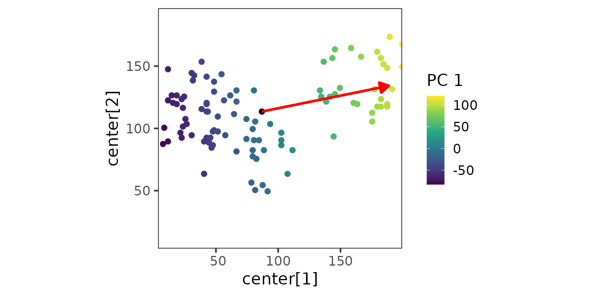

Then, we order the $`q`$ clusters according to the first principal
component:

``` r

for (nk in clustgrid$nk) {
    # compute cluster centroids and project that centroid to the first PC
    centr_tpoints <- sapply(tabclust[[nk]]$clust_nk, function(x) {
        centrpca <- matrix(apply(sample_coords[clust_nk[[nk]] %in% x, , drop = FALSE], 2, mean), nrow = 1)
        colnames(centrpca) <- colnames(sample_coords)
        return(predict(pcacoords, centrpca))
    })
    # Order the clusters along this first PC to ensure spatial separation when merging them later
    tabclust[[nk]]$centrpca <- centr_tpoints
    tabclust[[nk]] <- tabclust[[nk]][order(tabclust[[nk]]$centrpca), ]
}
```

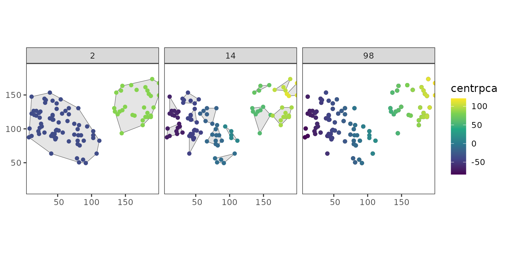

And lastly, we merge the $`q`$ clusters along the first principal
component:

``` r

clust_k <- list()
tabclust2 <- list()
for (nk in clustgrid$nk) {
    # We don't merge big clusters
    clust_i <- 1
    for (i in 1:nrow(tabclust[[nk]])) {
        if (tabclust[[nk]]$Freq[i] >= nrow(samples) / k) {
            tabclust[[nk]]$clust_k[i] <- clust_i
            clust_i <- clust_i + 1
        }
    }
    rm("clust_i")

    ## And we merge the remaining nk clusters into k groups
    clust_i <- setdiff(1:k, unique(tabclust[[nk]]$clust_k))
    # tabclust is ordered along PC1 and thus repeating a sequence
    # from 1:k to assign folds results in spatially separated merging of clusters
    tabclust[[nk]]$clust_k[is.na(tabclust[[nk]]$clust_k)] <- rep(clust_i, ceiling(nk / length(clust_i)))[
        1:sum(is.na(tabclust[[nk]]$clust_k))
    ]

    # Then creating a new data frame containing the raw nk cluster assignment for each point
    tabclust2[[nk]] <- data.frame(ID = 1:length(clust_nk[[nk]]), clust_nk = clust_nk[[nk]])
    # And add the assignment to k folds to them (clust_k)
    tabclust2[[nk]] <- merge(tabclust2[[nk]], tabclust[[nk]], by = "clust_nk")
    tabclust2[[nk]] <- tabclust2[[nk]][order(tabclust2[[nk]]$ID), ]
    clust_k[[nk]] <- tabclust2[[nk]]$clust_k
    tabclust2[[nk]]$nk <- nk # For plotting only
}
```

    #> Warning: `scale_fill_colorblind()` was deprecated in ggthemes 5.2.0.
    #> This warning is displayed once per session.
    #> Call `lifecycle::last_lifecycle_warnings()` to see where this warning was
    #> generated.

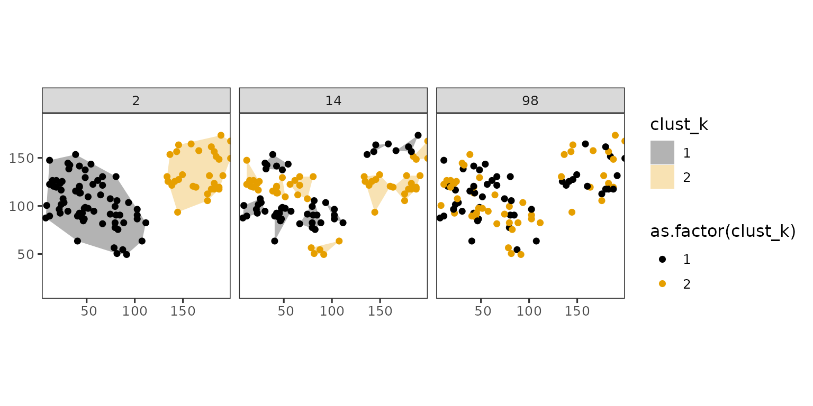

### 5. Calculate $`G_j^*`$ for each $`q`$ configuration and calculate $`W`$

``` r

distclust_euclidean <- function(tr_coords, folds) {
    alldist <- rep(NA, length(folds))
    for (f in unique(folds)) {
        alldist[f == folds] <- c(FNN::knnx.dist(
            query = tr_coords[f == folds, , drop = FALSE],
            data = tr_coords[f != folds, , drop = FALSE],
            k = 1
        ))
    }
    alldist
}

Gjstar_i <- list()
for (nk in clustgrid$nk) {
    # Compute W statistic if not exceeding maxp
    if (!any(table(clust_k[[nk]]) / length(clust_k[[nk]]) > 0.8)) {
        Gjstar_i[[nk]] <- distclust_euclidean(sample_coords, clust_k[[nk]])
        clustgrid$W[clustgrid$nk == nk] <- twosamples::wass_stat(Gjstar_i[[nk]], Gij)
        clustgroups[[paste0("nk", nk)]] <- clust_k[[nk]]
    }
}
```

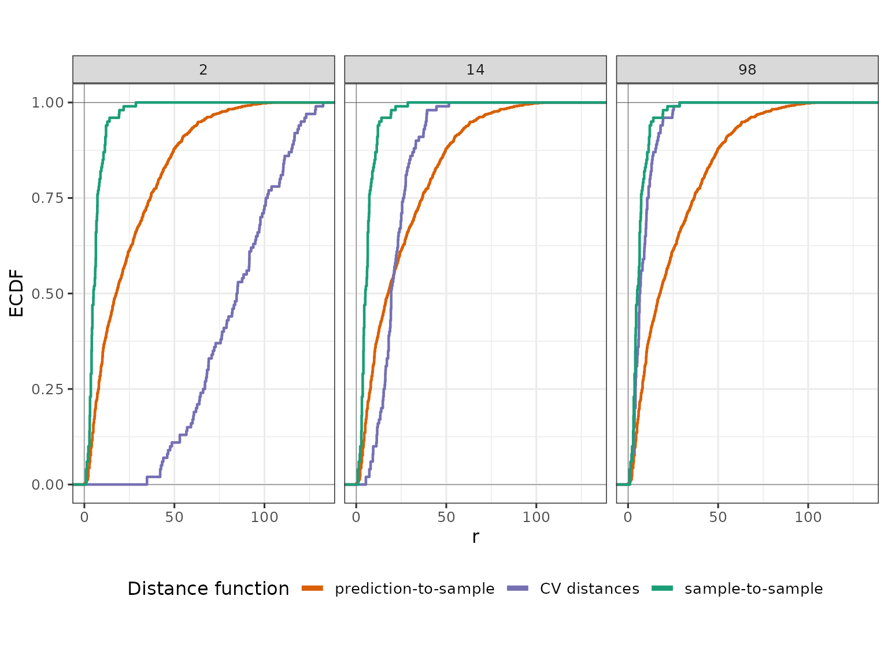

    #>   nk         W
    #> 1  2 59.830638
    #> 2 14  9.255344
    #> 3 98 15.824061

### 6. Return the configuration yielding the lowest $`W`$

``` r

k_final <- clustgrid$nk[which.min(clustgrid$W)]
W_final <- min(clustgrid$W, na.rm = T)
clust <- clustgroups[[paste0("nk", k_final)]]
Gjstar <- distclust_euclidean(sample_coords, clust)

print(k_final)
#> [1] 14
```

The following plot shows the training samples with their final fold
assignment:

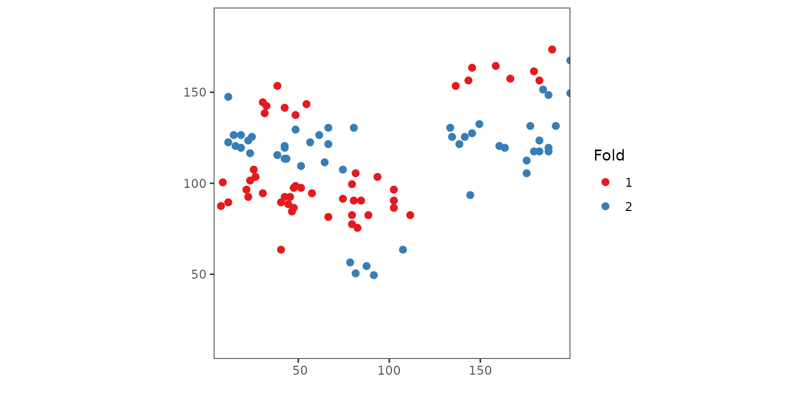

## Summary

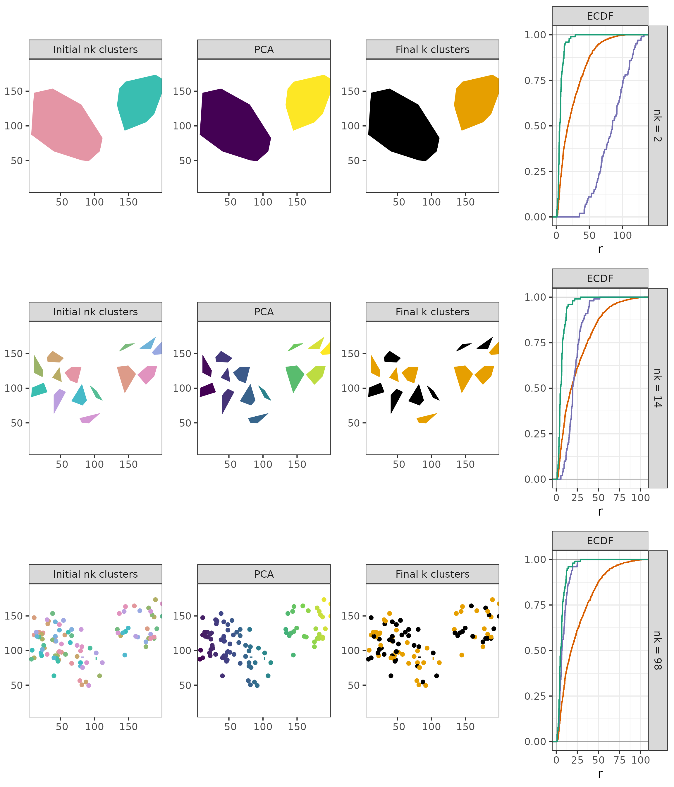
