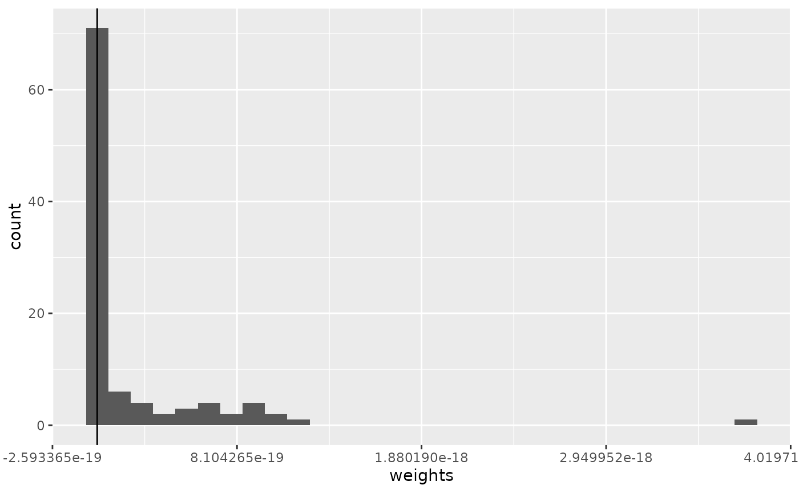
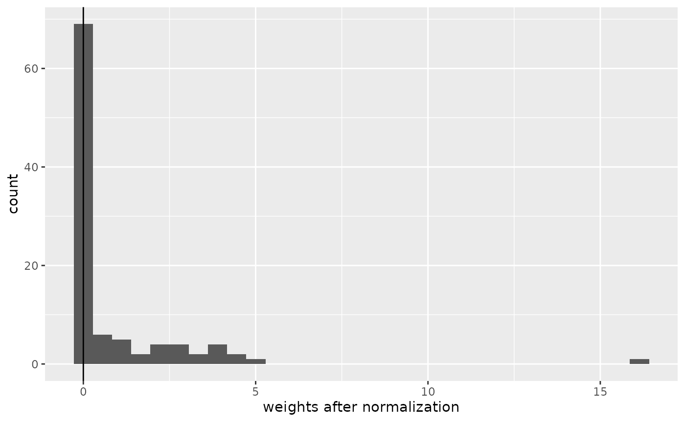
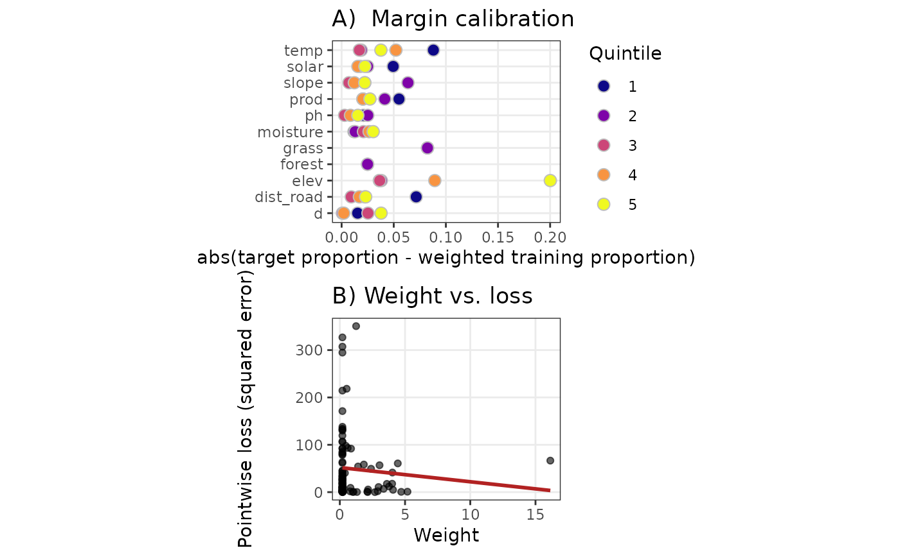

# TWCV

## Introduction

Target-Weighted Cross-Validation (TWCV) was developed by Brenning and
Suesse (2026). It uses iterative calibration weighting to align the
validation task (predictor values of the training points and
nearest-neighbour distances (NNDs) between folds) to the prediction task
(predictor values of the prediction points and NNDs between prediction
and training points).

The more detailed workflow is:

1.  Compute CV losses by training a model on the training folds fold and
    predicting to the held-out fold
2.  Compute the CV validation task and the prediction task (NNDs and
    predictor values)
3.  Calculate quantiles of the balancing variables for training and
    prediction points separately (NNDs and predictors)
4.  Calculate the proportion of training points and prediction points
    falling in each quantile
5.  Applies iterative proportional fitting (“raking”) to align the
    proportions of the training points to those in the prediction
    points:
    1.  For each balancing variable, calculate the current number of
        training points in each quantile.
    2.  Calculate the target number of training points in each quantile
        based on the target proportions.
    3.  Calculate multiplicative adjustment factors that transform the
        current counts to the target counts.
    4.  Because the weighting is done for each variable seperately
        (“marginal”), correcting one variable can disturb variables
        adjusted earlier.
    5.  Repeat this process until the maximum relative change in weights
        between successive iterations falls below a threshold.
6.  Normalize weights and shrink them towards 1 to mitigate extreme
    values.

## Setup

``` r

library(PDAV)
library(dplyr)
#> 
#> Attaching package: 'dplyr'
#> The following objects are masked from 'package:stats':
#> 
#>     filter, lag
#> The following objects are masked from 'package:base':
#> 
#>     intersect, setdiff, setequal, union
library(caret)
#> Loading required package: ggplot2
#> Loading required package: lattice
library(terra)
#> terra 1.9.34
library(sf)
#> Linking to GEOS 3.12.1, GDAL 3.8.4, PROJ 9.4.0; sf_use_s2() is TRUE
library(simsam)
library(ggplot2)
library(cowplot)
library(tidyterra)
#> 
#> Attaching package: 'tidyterra'
#> The following object is masked from 'package:stats':
#> 
#>     filter
library(ggnewscale)

set.seed(10)
```

## Simulate predictors and response

``` r

r <- PDAV:::generate_rast()
predictor_stack <- r[[setdiff(names(r), "outcome")]]
cate_rasters <- which(names(r) %in% c("forest", "grass"))

n_sample <- 100

sampling_r <- r
sampling_r[sampling_r$elev > 60] <- NA

samples <- sam_field(
    x = sampling_r,
    size = n_sample,
    method = sample_clustered(nclusters = 10, radius = 60, na.rm = TRUE)
)

predictor_vars <- names(predictor_stack)
env_vars <- predictor_vars
task_vars <- env_vars
response <- "outcome"
pred_points <- spatSample(predictor_stack, 1000, method = "regular", na.rm = TRUE, as.points = TRUE) |>
    st_as_sf()

sample_coords <- st_coordinates(samples) |> as.data.frame() |> rename("x" = X, "y" = Y)
grid_coords <- st_coordinates(pred_points) |> as.data.frame() |> rename("x" = X, "y" = Y)
sample_dat <- st_drop_geometry(samples) |>
    mutate(id = row_number()) |>
    cbind(sample_coords)
grid_dat <- st_drop_geometry(pred_points) |>
    mutate(id = row_number()) |>
    cbind(grid_coords)

twcv_specs <- PDAV:::make_twcv_specs(
    predictor_vars = predictor_vars,
    include_distance = TRUE,
    balance_by = 0.2,
    shrink_lambda = 0.2,
    name = "twcv_extended"
)

fit_fun <- function(train_dat, model, response, predictor_vars = NULL, ...) {
    if (is.null(predictor_vars)) {
        predictor_vars <- setdiff(names(train_dat), response)
    }

    dat <- train_dat[, c(response, predictor_vars), drop = FALSE]

    ranger::ranger(
        formula = stats::reformulate(predictor_vars, response = response),
        data = dat,
        ...
    )
}

predict_fun <- function(fit, newdata, ...) {
    predict(fit, data = newdata)$predictions
}

model <- "rf"

folds <- sample(rep(1:5, length.out = n_sample))
```


Figure 1: The training points and one predictor (elevation)

## Run TWCV

### 1. Compute CV losses

Iterate over each fold and calculate the predictions and the resulting
pointwise CV error:

``` r

pred <- PDAV:::compute_cv_predictions(
    sample_dat = sample_dat,
    folds = folds,
    model = model,
    response = response,
    fit_fun = fit_fun,
    predict_fun = predict_fun
)

pe <- PDAV:::compute_pointwise_errors(
    obs = sample_dat[[response]],
    pred = pred
)

cv_losses <- data.frame(
    id = sample_dat$id,
    fold = folds,
    obs = pe$obs,
    pred = pe$pred,
    error = pe$error,
    se = pe$se,
    ae = pe$ae
)

knitr::kable(head(cv_losses))
```

|  id | fold |      obs |     pred |     error |        se |       ae |
|----:|-----:|---------:|---------:|----------:|----------:|---------:|
|   1 |    4 | 43.86851 | 35.89420 |  7.974311 | 63.589631 | 7.974311 |
|   2 |    4 | 42.79048 | 40.06923 |  2.721253 |  7.405216 | 2.721253 |
|   3 |    3 | 55.96345 | 52.26969 |  3.693756 | 13.643835 | 3.693756 |
|   4 |    3 | 30.84508 | 37.53789 | -6.692808 | 44.793686 | 6.692808 |
|   5 |    3 | 34.29852 | 38.66652 | -4.368001 | 19.079436 | 4.368001 |
|   6 |    2 | 30.15781 | 36.53860 | -6.380787 | 40.714441 | 6.380787 |

### 2. Compute the CV validation task and the prediction task

``` r

d_sample <- PDAV:::nearest_neighbor_distance(
    query_coords = sample_dat[, c("x", "y")],
    ref_coords = sample_dat[, c("x", "y")],
    exclude_self = TRUE
)

d_grid <- PDAV:::nearest_neighbor_distance(
    query_coords = grid_dat[, c("x", "y")],
    ref_coords = sample_dat[, c("x", "y")],
    exclude_self = FALSE
)

sample_tasks <- data.frame(
    id = sample_dat$id,
    d = d_sample,
    stringsAsFactors = FALSE
)

grid_tasks <- data.frame(
    id = grid_dat$id,
    d = d_grid,
    stringsAsFactors = FALSE
)

for (v in env_vars) {
    sample_tasks[[v]] <- sample_dat[[v]]
    grid_tasks[[v]] <- grid_dat[[v]]
}

tasks <- list(
    sample_tasks = sample_tasks,
    grid_tasks = grid_tasks
)

sample_desc <- tasks$sample_tasks
idx <- match(cv_losses$id, sample_desc$id)

# combine CV losses with task descriptors for training points
out <- cv_losses
for (v in task_vars) {
    if (!(v %in% names(sample_desc))) {
        stop("Variable '", v, "' missing in sample_tasks.", call. = FALSE)
    }
    out[[v]] <- sample_desc[[v]][idx]
}

# Calculates the NND between folds based on distance matrix / matrices
d_realized <- PDAV:::compute_cv_prediction_distances(
    sample_dat = sample_dat,
    folds = cv_losses$fold
)

# Update the NND attached to the training points from NND between points to NND between folds
idx_d <- match(out$id, sample_dat$id)
out$d <- d_realized[idx_d]

aug <- list(
    losses = out,
    grid_tasks = tasks$grid_tasks
)

knitr::kable(head(aug$losses))
```

| id | fold | obs | pred | error | se | ae | temp | moisture | ph | slope | solar | dist_road | prod | elev | forest | grass | d |
|---:|---:|---:|---:|---:|---:|---:|---:|---:|---:|---:|---:|---:|---:|---:|---:|---:|---:|
| 1 | 4 | 43.86851 | 35.89420 | 7.974311 | 63.589631 | 7.974311 | 58.65872 | 49.55558 | 31.40340 | 41.89452 | 46.79640 | 54.96806 | 68.77220 | 16.85107 | 1 | 1 | 5.000000 |
| 2 | 4 | 42.79048 | 40.06923 | 2.721253 | 7.405216 | 2.721253 | 48.22472 | 33.45135 | 47.35910 | 45.57008 | 37.40257 | 61.39853 | 67.77885 | 47.02244 | 1 | 1 | 2.236068 |
| 3 | 3 | 55.96345 | 52.26969 | 3.693756 | 13.643835 | 3.693756 | 46.16339 | 37.06791 | 47.88919 | 55.71479 | 49.57767 | 41.10692 | 65.54921 | 33.18069 | 1 | 1 | 5.000000 |
| 4 | 3 | 30.84508 | 37.53789 | -6.692808 | 44.793686 | 6.692808 | 49.47221 | 43.60763 | 39.77998 | 39.09646 | 45.97753 | 62.35091 | 72.40195 | 41.65279 | 1 | 1 | 5.099019 |
| 5 | 3 | 34.29852 | 38.66652 | -4.368001 | 19.079436 | 4.368001 | 53.41327 | 42.87292 | 44.17551 | 42.92340 | 39.52471 | 60.93626 | 70.42711 | 40.54993 | 1 | 1 | 3.000000 |
| 6 | 2 | 30.15781 | 36.53860 | -6.380787 | 40.714441 | 6.380787 | 41.62583 | 42.93876 | 43.63028 | 38.55518 | 49.82985 | 55.82698 | 54.30327 | 44.12113 | 1 | 1 | 8.944272 |

``` r

knitr::kable(head(aug$grid_tasks))
```

| id | d | temp | moisture | ph | slope | solar | dist_road | prod | elev | forest | grass |
|---:|---:|---:|---:|---:|---:|---:|---:|---:|---:|---:|---:|
| 1 | 29.15476 | 42.93632 | 66.18163 | 53.24734 | 48.42772 | 34.63536 | 43.43660 | 49.23057 | 12.29096 | 1 | 1 |
| 2 | 24.20744 | 47.40429 | 55.60081 | 51.50022 | 45.05933 | 39.41212 | 36.94975 | 53.64332 | 19.57157 | 1 | 1 |
| 3 | 19.84943 | 47.94994 | 50.36401 | 50.12981 | 46.43496 | 46.35029 | 32.63284 | 58.30790 | 27.51362 | 1 | 1 |
| 4 | 16.55295 | 51.40902 | 38.91773 | 50.01556 | 46.06878 | 50.02884 | 35.30530 | 58.72353 | 32.40647 | 1 | 1 |
| 5 | 15.00000 | 53.17910 | 44.21832 | 43.83926 | 47.86035 | 56.95484 | 30.75681 | 53.42314 | 20.88684 | 1 | 1 |
| 6 | 16.15549 | 55.71695 | 43.72394 | 47.65885 | 50.01531 | 51.39663 | 35.48978 | 55.83273 | 26.59958 | 1 | 1 |

### 3. Calculate quantiles of the balancing variables

The quantiles are calculated based on the distribution of the values of
the predictor variable at the prediction locations, and then applied to
the training points.

``` r

cv_losses <- aug$losses
grid_tasks <- aug$grid_tasks

unweighted_losses <- list(
    unweighted = PDAV:::summarize_losses(cv_losses)
)

sample_tasks_bal <- PDAV:::prepare_for_balancing(
    df = cv_losses,
    vars = twcv_specs$twcv_extended$balancing_vars,
    ref_df = grid_tasks,
    by = twcv_specs$twcv_extended$balance_by
)

grid_tasks_bal <- PDAV:::prepare_for_balancing(
    df = grid_tasks,
    vars = twcv_specs$twcv_extended$balancing_vars,
    ref_df = grid_tasks,
    by = twcv_specs$twcv_extended$balance_by
)

bal <- list(
    sample_tasks_bal = sample_tasks_bal,
    grid_tasks_bal = grid_tasks_bal
)
```


Figure 2: The quintiles of elevation at the prediction points, overlaid
by the density of the elevation values at the training points (A) and
the prediction points (B).

### 4. Calculate frequencies for the quantiles

``` r

balance_df <- as.data.frame(
    lapply(twcv_specs$twcv_extended$balancing_vars, function(v) sample_tasks_bal[[paste0(v, "_cat")]])
)
names(balance_df) <- twcv_specs$twcv_extended$balancing_vars

# Calculates proportion of predpoints in each quantile of each predictor used for weighting
target_margins <- PDAV:::compute_target_margins_generic(
    grid_tasks_bal = grid_tasks_bal,
    balancing_vars = twcv_specs$twcv_extended$balancing_vars
)
target_margins$elev
#> [1] 0.2001953 0.2001953 0.1992188 0.2001953 0.2001953

# For visualization only: margins of samples
levs <- seq_along(target_margins[["elev"]])
freq_samples <- table(factor(as.integer(balance_df[["elev"]]), levels = levs))
as.numeric(freq_samples) / sum(freq_samples)
#> [1] 0.28 0.28 0.31 0.13 0.00
```

### 5. Apply Raking

In this example, one elevation quintile of the prediction locations is
not covered by the training points. However, this does not return an
error. Instead, if a quintile is not covered by the training points,
raking keeps trying to assign importance to a region it cannot
represent, and drives the weight of most training points toward zero. A
better approach would likely be to stop the algorithm and return an
error message hinting towards avoiding this extreme extrapolation. See
section 8 and Figure 2.

``` r

margin_names <- names(target_margins)
max_iter <- 500
tol <- 1e-6
n <- nrow(balance_df)
w <- rep(1, n)

for (iter in seq_len(max_iter)) {
    w_old <- w

    for (m in margin_names) {
        x <- as.integer(balance_df[[m]])
        levs <- seq_along(target_margins[[m]])
        target_prop <- target_margins[[m]]

        # calculate the number of training points currently in each quantile
        # uses the weights from the previous balancing variable
        # -> already weighted, but likely not ideally for this variable
        current_totals <- tapply(w, factor(x, levels = levs), sum)
        current_totals[is.na(current_totals)] <- 0

        # calculate the desired number of training points in each quantile that matches the target margins:
        # Number of training points * target proportion vector
        target_totals <- sum(w) * target_prop

        adj <- rep(1, length(levs))
        ok <- current_totals > 0

        # calculates the weight needed to adjust the training point distribution to the target margins
        # (weights > 1 are used to up-weigh underrepresented classes, weights < 1 to down-weight over-represented ones)
        adj[ok] <- target_totals[ok] / current_totals[ok]
        adj[!ok] <- NA_real_

        # Checks for all training points if they fall in the distribution of the grid
        # However, if one quintile of the prediction domain is not covered by the training data, this does not return an error
        # Instead, if a quintile is not covered by the training points, the weights shrink towards 0 and the algorithm "converges"
        valid <- !is.na(adj[x])
        w[valid] <- w[valid] * adj[x[valid]]
    }

    # Compute the relative strength of the absolute change of weights from base (or previous) to new weights
    rel_change <- max(abs(w - w_old) / pmax(abs(w_old), 1e-12))

    # When the changes converge (i.e., when the weight difference from previous iteration to new one is small), stop and return weights
    # (when the weights for predictor B are changed, weights for predictor A might be off again, and another iteration starts,
    # until the diff between them is small)
    if (rel_change < tol) break
}

converged <- iter < max_iter || rel_change < tol

tw <- list(
    weights = w,
    converged = converged,
    iterations = iter
)

ggplot() +
    geom_histogram(data = data.frame(weights = tw$weights), aes(x = weights)) +
    geom_vline(xintercept = 0)
#> `stat_bin()` using `bins = 30`. Pick better value `binwidth`.
```



### 6. Normalize and shrink weights

``` r

# Weights are normalized by their mean and shrinked towards 1 to mitigate extreme values
shrink_lambda <- twcv_specs$twcv_extended$shrink_lambda
tw$weights_raw <- PDAV:::normalize_weights(tw$weights)
tw$weights <- PDAV:::shrink_weights(tw$weights_raw, lambda = shrink_lambda)
tw$shrink_lambda <- shrink_lambda
tw$balancing_vars <- twcv_specs$twcv_extended$balancing_vars

ggplot() +
    geom_histogram(data = data.frame(weights = tw$weights), aes(x = weights)) +
    xlab("weights after normalization") +
    geom_vline(xintercept = 0)
#> `stat_bin()` using `bins = 30`. Pick better value `binwidth`.
```



### 7. Return weighted error estimates

The following plots show the calibration (i.e., how good could the
raking match the target proportion). It also shows which points (with
their corresponding errors) received which weight.

``` r

est_list <- PDAV:::summarize_losses(cv_losses, tw$weights)
weight_objects <- tw

result <- list(
    losses = cv_losses,
    estimators = est_list,
    weights = weight_objects,
    twcv_specs = twcv_specs,
    balance_df = balance_df, # added for plotting purpose
    target_margins = target_margins # added for plotting purpose
)
class(result) <- "twcv"

plot(result) |>
    plot_grid(plotlist = _, ncol = 1, align = "v")
```



``` r

# True error:
fit <- fit_fun(
    sample_dat |> select(all_of(c(predictor_vars, response))),
    model = model,
    response = response
)
prediction <- terra::predict(
    predictor_stack,
    fit,
    fun = function(model, data, ...) {
        predict(model, data = data)$predictions
    },
    na.rm = TRUE
)
samples_pred <- terra::as.points(prediction) |>
    st_as_sf() |>
    rename("prediction" = lyr1)
samples_pred <- terra::extract(r$outcome, samples_pred, bind = TRUE)

map_error <- caret::postResample(pred = samples_pred$prediction, obs = samples_pred$outcome)
```

The unweighted CV error is 6.11, while the weighted error is 6.995. The
true map error is 7.468.

### 8. Check if the inputs were supported for raking

The highest elevation quintile of the prediction area is not represented
by any training points (and with stronger clustering, e.g. radius = 30,
the distance variable would be unsupported as well). Raking cannot
succeed, because it is asked to assign weight to a region the training
data does not cover. A possible solution might be to constrain the
prediction domain, e.g., to the Area of Applicability (Meyer and Pebesma
(2021)). Ideally, the algorithm would detect this case and stop. It is
worth noting that normalizing the weights by their mean can make the
output look reasonable on average, even though most individual weights
have collapsed towards zero — so this issue is easy to overlook without
diagnostics such as the effective sample size.

``` r

support_check <- PDAV:::check_balance_support(balance_df, target_margins)
support_check |>
    dplyr::group_by(var) |>
    dplyr::summarise(
        target_mass_covered = sum(target_prop[sample_n > 0]),
        n_unsupported_bins = sum(unsupported),
        .groups = "drop"
    )
#> # A tibble: 11 × 3
#>    var       target_mass_covered n_unsupported_bins
#>    <chr>                   <dbl>              <int>
#>  1 d                       1                      0
#>  2 dist_road               1                      0
#>  3 elev                    0.800                  1
#>  4 forest                  1                      0
#>  5 grass                   1                      0
#>  6 moisture                1                      0
#>  7 ph                      1                      0
#>  8 prod                    1                      0
#>  9 slope                   1                      0
#> 10 solar                   1                      0
#> 11 temp                    1                      0

# Effective sample size after weighting
ess <- sum(tw$weights)^2 / sum(tw$weights^2)
ess_ratio <- ess / length(tw$weights) # warn if << 1, e.g. < 0.3
ess_ratio
#> [1] 0.2055392

# How much target mass lands in bins the training data barely covers
support_check |>
    group_by(var) |>
    summarise(
        target_mass_in_thin_bins = sum(target_prop[sample_n <= 2]), # bins with ≤2 points
        max_ratio = max(target_prop / pmax(sample_n / sum(sample_n), 1e-9))
    )
#> # A tibble: 11 × 3
#>    var       target_mass_in_thin_bins    max_ratio
#>    <chr>                        <dbl>        <dbl>
#>  1 d                            0.199        19.9 
#>  2 dist_road                    0             1.05
#>  3 elev                         0.200 200195312.  
#>  4 forest                       0             1.42
#>  5 grass                        0             2.77
#>  6 moisture                     0             1.54
#>  7 ph                           0             2.86
#>  8 prod                         0             1.43
#>  9 slope                        0             1.33
#> 10 solar                        0             1.33
#> 11 temp                         0             6.67

zero_idx <- tw$weights_raw < 0.05 * mean(tw$weights_raw)
sum(zero_idx)
#> [1] 67
```

Brenning, Alexander, and Thomas Suesse. 2026. *Aligning Validation with
Deployment: Target-Weighted Cross-Validation for Spatial Prediction*.
arXiv. <https://doi.org/10.48550/ARXIV.2603.29981>.

Meyer, Hanna, and Edzer Pebesma. 2021. “Predicting into Unknown Space?
Estimating the Area of Applicability of Spatial Prediction Models.”
*Methods in Ecology and Evolution* 12 (9): 1620–33.
https://doi.org/<https://doi.org/10.1111/2041-210X.13650>.
